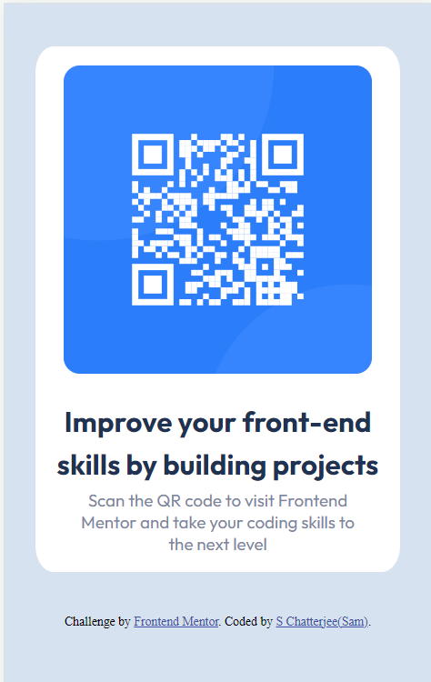

# Frontend Mentor - QR code component solution

This is a solution to the [QR code component challenge on Frontend Mentor](https://www.frontendmentor.io/challenges/qr-code-component-iux_sIO_H). Frontend Mentor challenges help you improve your coding skills by building realistic projects. 

## Table of contents

- [Overview](#overview)
  - [Screenshot](#screenshot)
  - [Links](#links)
- [My process](#my-process)
  - [Built with](#built-with)
  - [What I learned](#what-i-learned)
  - [Continued development](#continued-development)
  - [Useful resources](#useful-resources)
- [Author](#author)
- [Acknowledgments](#acknowledgments)

**Note: Delete this note and update the table of contents based on what sections you keep.**

## Overview

### Screenshot




### Links

- Solution URL: [QR Code Componenet Solution([[https://your-solution-url.com](https://qr-code-solution-tawny.vercel.app/)](https://github.com/WillOfHeaven/QR-code-Solution))
- Live Site URL: [QR Code Componenet Solution([https://your-solution-url.com](https://qr-code-solution-tawny.vercel.app/))

## My process

### Built with

- Semantic HTML5 markup
- CSS custom properties
- Flexbox

### What I learned

```html
<h1>Some HTML code I'm proud of learning about the concept of flex box</h1>
```
```css
.proud-of-this-css concept that I learn : media query {
  color: papayawhip;
}


If you want more help with writing markdown, we'd recommend checking out [The Markdown Guide](https://www.markdownguide.org/) to learn more.

### Useful resources

- [Example resource 1](https://www.example.com) - This helped me for XYZ reason. I really liked this pattern and will use it going forward.
- [Example resource 2](https://www.example.com) - This is an amazing article which helped me finally understand XYZ. I'd recommend it to anyone still learning this concept.

## Author

- Frontend Mentor - [@WillOfHeaven]([https://www.frontendmentor.io/profile/yourusername](https://www.frontendmentor.io/profile/WillOfHeaven))
